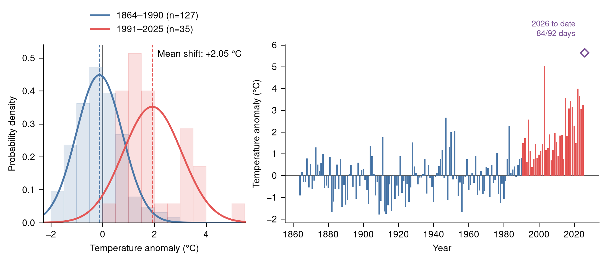

# Swiss summer temperatures, 1864–today

[](https://github.com/p3jitnath/meteoswiss-analysis/actions/workflows/ci.yml)
[](https://github.com/p3jitnath/meteoswiss-analysis/actions/workflows/pages.yml)

A reproducible update of Christoph Schär's visual comparison of historical and recent
Swiss warm-season temperatures. The project uses homogeneous MeteoSwiss 2m air-temperature
series from Basel/Binningen, Bern, Geneva and Zürich, recreates the distribution comparison,
and adds an explicit summer-to-date view when the current JJA season is incomplete.

The interactive site is published at
**https://p3jitnath.github.io/meteoswiss-analysis/**.



## Scientific scope

- **Primary season:** June–August (JJA), as requested.
- **Companion reproduction:** April–September, matching the 2018 ETH visualisation.
- **Observations:** MeteoSwiss Swiss NBCN homogeneous station series.
- **Stations:** Basel/Binningen (`BAS`), Bern/Zollikofen (`BER`), Geneva/Cointrin (`GVE`),
  and Zürich/Fluntern (`SMA`). These are the current homogeneous continuations of the four
  long records described by Schär et al. (2004).
- **Aggregation:** equal average across stations, then day-weighted monthly aggregation.
- **Reference:** 1961–1990 mean for completed-season anomalies.
- **Incomplete season:** daily homogeneous values through the retrieval date, compared with
  the identical calendar window in 1961–1990. It is visually and semantically marked provisional.

Monthly homogeneous values are the canonical input for complete seasons, following
MeteoSwiss guidance for long-term climatology. Daily homogeneous values are statistically
derived and are used only for the provisional season-to-date calculation.

## Reproduce everything

Requirements are Python 3.11+ and [`uv`](https://docs.astral.sh/uv/).

```bash
./scripts/reproduce.sh
```

Or run stages separately:

```bash
uv sync --extra dev
uv run meteoswiss-analysis download
uv run meteoswiss-analysis analyse
uv run meteoswiss-analysis plot
```

The plotting stage produces PDF vector files and 300 dpi PNG files. The project uses the
graph-plotting skill's portable Nimbus Sans fonts and audits every rendered text element.
All Python functions use NumPy-style documentation, enforced by Ruff's NumPy pydocstyle profile.

## Repository layout

```text
src/meteoswiss_analysis/  acquisition, analysis, and plotting package
data/raw/                 downloaded source data and provenance manifest
data/processed/           tidy CSV and JSON outputs
figures/                  publication-ready PDF and PNG figures
website/                  React + TypeScript interactive site
tests/                    scientific aggregation tests
.github/workflows/        CI, weekly refresh, and GitHub Pages deployment
```

The website's grid, typography, responsive composition, reveal behaviour, and accessibility
decisions are documented in [`docs/web-design-system.md`](docs/web-design-system.md).

## Automation

- `ci.yml` tests and lints Python, reproduces the analysis, and builds the React site.
- `pages.yml` refreshes MeteoSwiss data weekly and deploys the rebuilt site to GitHub Pages.
  It can also be run manually.

Because GitHub Pages must be enabled at repository level, select **Settings → Pages → Source:
GitHub Actions** after the first push if it is not already enabled.

## References and attribution

- Schär, C. et al. (2004), *The role of increasing temperature variability in European
  summer heatwaves*, Nature 427, 332–336. https://doi.org/10.1038/nature02300
- ETH Zürich (2018), *Climate change in Switzerland – represented visually*.
- MeteoSwiss Open Data, collection `ch.meteoschweiz.ogd-nbcn`.

**Data source: MeteoSwiss.** The code is MIT licensed. MeteoSwiss data are redistributed
under the provider's open-data terms; consult the source terms before reuse.
